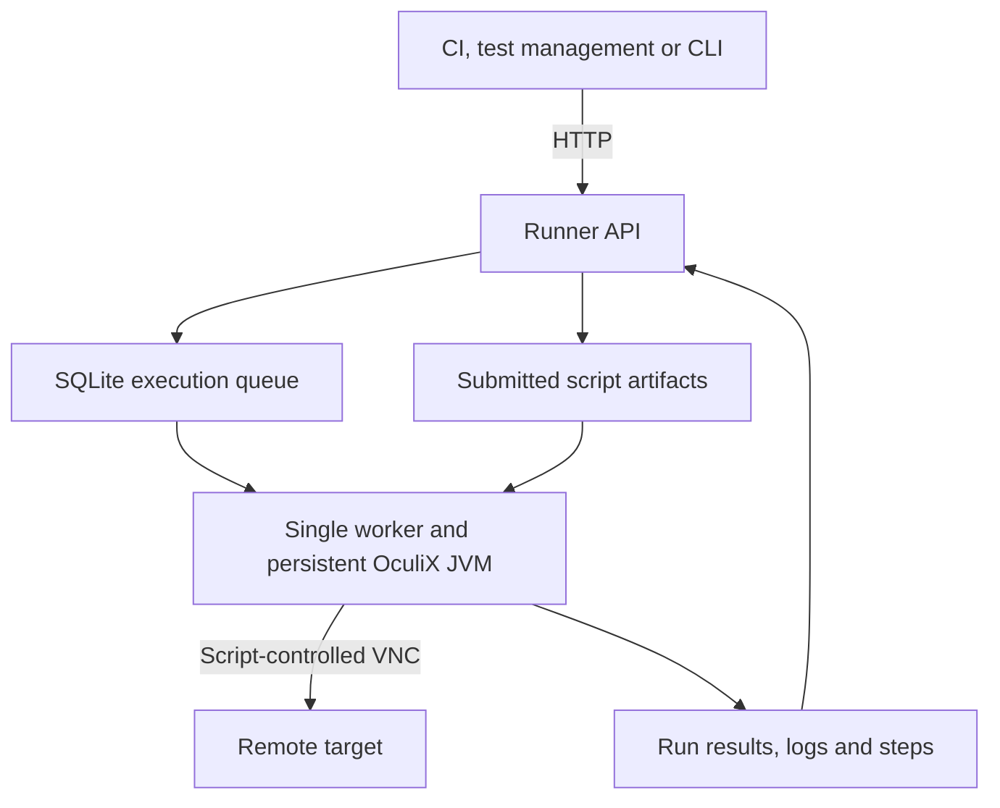
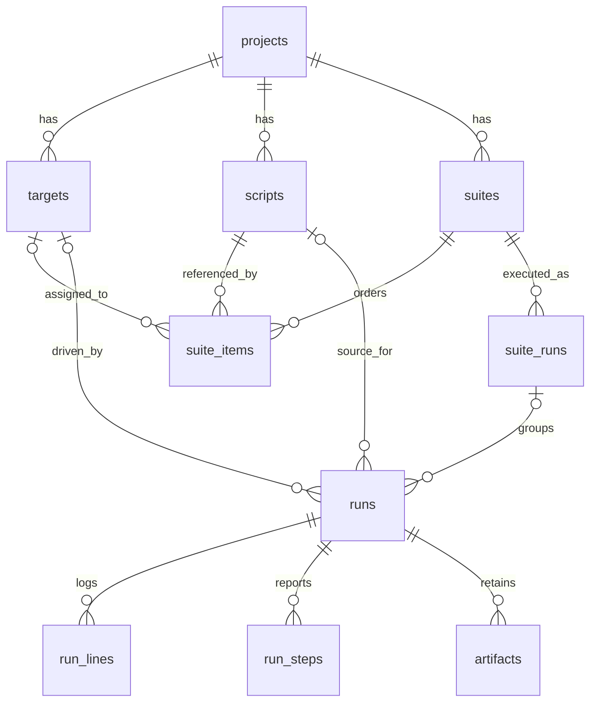

# OculiX Runner

[](LICENSE)
[](service/pom.xml)
[](https://github.com/oculix-org/Oculix)

**Run your OculiX tests in CI/CD.**

OculiX Runner brings your visual automation scripts into your CI pipeline. Deploy the runner with Docker, submit scripts or suites over HTTP, stream execution logs into your job, and use the final test status to pass or fail the pipeline.

Tests run headlessly, with OculiX kept ready between executions. Connect your VNC targets and run your visual checks without opening the IDE. A TK5/KICKS mainframe lab is included as an optional demo target.

## ✨ What you get

- **Persistent runtime and queue:** OculiX/Jython initialized once, one script at a time, queued runs stored in SQLite.
- **Projects, scripts and suites:** inline code or stored scripts, ordered suites, per-item targets and parameters.
- **Live results:** streamed logs, declared steps, timeouts and cancellation.
- **Traceability:** submitted script and hash, run parameters, timings, OculiX version and JAR hash.
- **API keys and audit:** hierarchical scopes and an action journal.

API examples: [docs/API.md](docs/API.md) · OpenAPI: [docs/openapi.yaml](docs/openapi.yaml).

## 🚀 Quick start

You need Docker with Docker Compose. The examples use Bash, `curl` and `jq` to read returned IDs.

### 🐳 Build and start

```bash
git clone https://github.com/julienmerconsulting/oculix-runner.git
cd oculix-runner

# Choose a nonempty key before the first startup.
export RUNNER_BOOTSTRAP_KEY='orx_replace_with_your_own_key'

docker compose build oculix-runner
docker compose up -d oculix-runner

curl -fsS http://localhost:8765/health
```

Only the runner starts. Wait for `"engine":"ready"` in `/health`; earlier submissions wait in the queue.

Set a nonempty bootstrap key for the supplied Compose file. It creates the initial admin key only when the database has no keys; keep that key for subsequent API calls.

### ▶️ First run

Try a first run without an external target:

```bash
B='http://localhost:8765'
K="X-Api-Key: ${RUNNER_BOOTSTRAP_KEY}"

PROJECT_ID=$(curl -fsS -X POST "$B/projects" \
  -H "$K" -H 'Content-Type: application/json' \
  -d '{"code":"quickstart","name":"Quick start"}' | jq -er '.id')

RUN_ID=$(jq -n --argjson project_id "$PROJECT_ID" \
  '{project_id: $project_id,
    name: "First headless run",
    params: {message: "Hello from OculiX Runner"},
    code: "step(\"Greeting\", \"START\")\nprint(PARAMS[\"message\"])\nassert PARAMS[\"message\"]\nstep(\"Greeting\", \"PASS\")\n"}' \
  | curl -fsS -X POST "$B/runs" \
      -H "$K" -H 'Content-Type: application/json' --data-binary @- \
  | jq -er '.id')

curl -fsSN -H "$K" "$B/runs/$RUN_ID/log/stream"
curl -fsS -H "$K" "$B/runs/$RUN_ID" | jq .
```

The stream ends with the run status and duration. The JSON response includes its exit code and steps.

On repeat runs, reuse the project ID from `GET /projects`; project codes are unique.

## 🖥️ Connect a VNC target

Register a target whose host and port are reachable **from the runner container**. Use the VNC server's port, not a noVNC browser port.

```bash
TARGET_ID=$(jq -n \
  '{name: "desktop", kind: "vnc", host: "your-vnc-host", port: 5900, stage: "INT"}' \
  | curl -fsS -X POST "$B/projects/$PROJECT_ID/targets" \
      -H "$K" -H 'Content-Type: application/json' --data-binary @- \
  | jq -er '.id')

curl -fsS -H "$K" "$B/targets/$TARGET_ID/check" | jq .
```

`/check` tests TCP connectivity only.

Save the following as `capture-check.py`:

```python
from org.sikuli.vnc import VNCScreen

step("VNC capture", "START")
vnc = VNCScreen.start(TARGET["host"], TARGET["port"], 10, 0)
try:
    if vnc is None or not vnc.isRunning():
        raise RuntimeError("VNC connection failed")

    image = vnc.capture().getImage()
    assert image.getWidth() > 0 and image.getHeight() > 0, "Empty capture"
    print("Captured %s x %s" % (image.getWidth(), image.getHeight()))
    step("VNC capture", "PASS")
except Exception as error:
    step("VNC capture", "FAIL", str(error))
    raise
finally:
    if vnc is not None:
        vnc.stop()
```

Upload the script and execute it against the target:

```bash
SCRIPT_ID=$(curl -fsS -X POST \
  "$B/projects/$PROJECT_ID/scripts/raw?name=capture-check" \
  -H "$K" --data-binary @capture-check.py | jq -er '.id')

RUN_ID=$(jq -n \
  --argjson project_id "$PROJECT_ID" \
  --argjson script_id "$SCRIPT_ID" \
  --argjson target_id "$TARGET_ID" \
  '{project_id: $project_id, script_id: $script_id,
    target_id: $target_id, timeout_ms: 60000}' \
  | curl -fsS -X POST "$B/runs" \
      -H "$K" -H 'Content-Type: application/json' --data-binary @- \
  | jq -er '.id')

curl -fsSN -H "$K" "$B/runs/$RUN_ID/log/stream"
```

Extend this capture check with OculiX interactions and application assertions.

For VNC authentication, set `secret_ref` to an environment variable passed to the container. The header resolves it into `TARGET["password"]` for your connection code; the example above does not configure authentication.

## ✍️ Write a script

Scripts execute as OculiX **Jython** code. The service prepends [header.py](service/src/main/resources/header.py), which imports `sikuli` and exposes:

| Name | Content |
|---|---|
| `RUN` | Run ID, name, parameters and target information. |
| `PARAMS` | The dictionary submitted as `params`, or an empty dictionary. |
| `TARGET` | Target metadata, including `kind`, `host`, `port`, `display` and `secret_ref` when a target is selected. |
| `TARGET["password"]` | Value resolved from the environment variable named by `secret_ref`, when configured. |
| `step(label, status, detail)` | Emits a structured step declaration into the run log. |

For a target with a host, the header also sets `TARGET_VNC_HOST` and `TARGET_VNC_PORT` in `os.environ`. The script owns its connections and should close them in `finally` blocks.

Targets can be `vnc` or `local`; `target_id` is optional. A local target refers to the runner environment. Scripts receive the metadata and handle their own display selection and connections.

### 🧪 Steps and test verdicts

Use `START`, `PASS`, `FAIL`, `SKIP` and `INFO` to report progress. A `START` followed by `PASS` or `FAIL` with the same label closes that step. Steps still open when execution ends become `INCOMPLETE`.

**A declared `FAIL` step does not by itself fail the run.** Use an assertion, raise an exception, or otherwise make the script return a failure through the OculiX runner. The global status is determined from execution, cancellation and timeout results.

Run statuses: `queued`, `running`, `passed`, `failed`, `timeout`, `aborted`, `error`, `skipped`. The internal `new` state covers script artifact creation. A run passes when OculiX returns exit code `0` without cancellation or detected timeout.

## 🔁 Suites and CI

Create an ordered suite through `POST /projects/{id}/suites`, with `script_id`, optional `target_id`, `params` and `continue_on_failure` for each item. Launch it with `POST /suites/{id}/run` and follow `GET /suite-runs/{id}`.

An unsuccessful item skips the remaining queued items unless its `continue_on_failure` flag is set. Suite launches can record `commit_sha`, `branch` and `retry_of` metadata.

In CI, wait for completion and use the terminal status as the job verdict. After the single-run log stream closes:

```bash
STATUS=$(curl -fsS -H "$K" "$B/runs/$RUN_ID" | jq -er '.status')
test "$STATUS" = passed
```

For JSON logs, use `GET /runs/{id}/log?after=<seq>&wait=<seconds>`; its response provides a cursor and a `finished` flag.

## 🧭 How it works



### ▶️ One run, from submission to result

The worker selects queued runs by ID and executes them in the shared Jython runtime.

```mermaid
sequenceDiagram
    participant C as Client
    participant A as API
    participant D as SQLite
    participant W as Worker / OculiX
    participant T as VNC target
    C->>A: POST /runs
    A->>D: Insert run with status new
    A->>A: Save submitted script.py
    A->>D: Register artifact and queue run
    A-->>C: Run ID
    W->>D: Select next queued run; mark running
    W->>W: Compose header, script and run.json
    opt Script uses VNC
        W->>T: Connect, interact and capture
        T-->>W: Screen data
    end
    W->>D: Store output and declared steps
    C->>A: GET /runs/{id}/log/stream
    A->>D: Read incremental output
    A-->>C: Stream log lines
    W->>D: Save status, exit code and duration
    A-->>C: Terminal status; close stream
```

### 🗄️ Data model

Core execution relationships from [schema.sql](service/src/main/resources/schema.sql):



Standalone runs have no suite execution; inline runs have no stored script. API keys, action audit and engine events live in `api_keys`, `audit_log` and `engine_events`.

Data lives in `/workdir`, persisted by the `runner-data` Docker volume:

| Path | Content |
|---|---|
| `runner.db` | Projects, targets, scripts, suites, runs, logs, steps, artifact metadata, API keys and journals. |
| `runs/run_<id>.sikuli/` | Composed script with its injected header and `run.json`. |
| `artifacts/<project-code>/<run-id>/script.py` | Copy of the submitted script for that execution. |

Each run keeps its submitted script even if the stored script changes later. Stored scripts have a version counter and current content, without a separate history of every edit.

The runner automatically registers **the submitted script** as an artifact. Screenshots or videos produced by scripts are not automatically collected or registered by the current service.

After a restart, queued runs remain available. Runs left in `running` are marked `error`; partially executed scripts are not resumed.

Implementation: [Engine.java](service/src/main/java/org/oculix/runner/Engine.java), [Api.java](service/src/main/java/org/oculix/runner/Api.java), [schema.sql](service/src/main/resources/schema.sql).

## 🔌 API access

All endpoints except `/health` require `X-Api-Key`. Scopes are hierarchical: `admin` includes `run`, which includes `read`.

| Scope | Access |
|---|---|
| `read` | Projects, targets, scripts, suites, runs, logs, steps, artifacts and runtime information. |
| `run` | Script and suite management, execution, cancellation and target connectivity checks. |
| `admin` | Project and target management, API keys and the action journal. |

Keys are stored as SHA-256 hashes; scopes apply across the service. Use `POST /keys` to create a key and `DELETE /keys/{id}` to revoke one.

Full routes, request bodies and responses: [docs/API.md](docs/API.md).

## ⚙️ Configuration

| Variable | Default | Purpose |
|---|---|---|
| `RUNNER_HTTP_PORT` | `8765` | HTTP listening port. |
| `RUNNER_DATA_DIR` | `/workdir` | Database, working directories and artifacts. |
| `OCULIX_JAR` | `/opt/oculix/oculix.jar` | OculiX JAR path used by the service. |
| `RUNNER_DEBUG_LEVEL` | `3` | OculiX debug level. |
| `RUNNER_DEFAULT_TIMEOUT_MS` | `0` | Default script timeout; `0` means no timeout. |
| `RUNNER_BOOTSTRAP_KEY` | See quick start | Initial admin key. |
| `RUNNER_DISPLAY_NUM` | `99` | Xvfb display number used by the container entrypoint. |
| `JAVA_OPTS` | Empty | Additional JVM options for the container entrypoint. |

Pass changes into the container through the Compose `environment` section and adjust port mappings when changing the listening port.

The build downloads OculiX **4.0.0** and verifies its pinned SHA-256. A local `jars/oculix.jar` takes precedence; that override is ignored by Git.

To change the download, set both build arguments `OCULIX_VERSION` and `OCULIX_SHA256`. The service records the loaded JAR's hash, including for a local override.

The lab notes flag ZRLE and x3270 `Key.ENTER` issues in the pinned release. The documented TSO validation used a local JAR from `chore/global-bug-fixes`.

### ☕ Build without Docker

With Java 17, Maven, Xvfb and the native libraries required by OculiX available:

```bash
cd service
mvn -Doculix.jar=/absolute/path/to/oculix.jar package

export OCULIX_JAR=/absolute/path/to/oculix.jar
export RUNNER_DATA_DIR="$PWD/workdir"
xvfb-run -a -s '-screen 0 1280x1024x24' \
  java -cp "target/oculix-runner-service.jar:$OCULIX_JAR" \
  org.oculix.runner.Main
```

The service JAR and the OculiX JAR share a classpath. The service does not bundle a modified copy of OculiX. See the [Dockerfile](Dockerfile) for the container's native dependencies.

## 🖥️ Optional mainframe lab

The `lab` Compose profile starts a demonstration mainframe environment: TK5, running MVS 3.8j under Hercules, with KICKS 1.5.0 installed.

```bash
docker compose --profile lab up -d
```

The demo image is pulled from GHCR. Allow time for the mainframe to initialize, then open [noVNC](http://localhost:6081/vnc.html).

Register its VNC target using host `target-mainframe-kicks` and port `5900` from the runner container. The host-side VNC port is `5901`.

| Resource | Purpose |
|---|---|
| [lab/KICKS.md](lab/KICKS.md) | Demo startup and installation notes. |
| [KICKS installation guide](lab/Guide_installation_KICKS_1.5.0_TK5_OculiX.pdf) | Detailed working guide in French. |
| [scripts/tk5-type.py](scripts/tk5-type.py) | Sends the HERC01 logon sequence; application success must be checked separately. |
| [scripts/oculix-check.py](scripts/oculix-check.py) | Checks capture and OCR; writes `/workdir/oculix-check.png`. |
| [lab/snapshot.sh](lab/snapshot.sh) | Prints a dated Markdown inventory of images, containers, network and runner contents. Does not back up containers or data. |

To save the lab inventory: `sh lab/snapshot.sh > lab/SNAPSHOT.md`.

## 📜 Credits and licenses

- **OculiX**, MIT: [oculix-org/Oculix](https://github.com/oculix-org/Oculix), the automation engine loaded by the service.
- **Hercules SDL Hyperion**: [SDL-Hercules-390/hyperion](https://github.com/SDL-Hercules-390/hyperion), the emulator used by the optional lab.
- **TK5**, by Rob Prins: [MVS 3.8j Turnkey system](https://www.prince-webdesign.nl/tk5).
- **KICKS for TSO 1.5.0**, © Michael Noel: [moshix/kicks](https://github.com/moshix/kicks). Its license is included in the lab image as member `HERC01.KICKSSYS.V1R5M0.DOC(LICENSE)`. The image redistributes the complete original package free of charge; the objects modified for TK5 and the added `MYLOGON` are supplied in source form next to the originals. No KICKS object is stored in this repository.

**This runner repository is licensed separately from OculiX**, under the [PolyForm Strict License 1.0.0](LICENSE). See that file for the applicable terms. Contact the author for commercial licensing through the [repository owner's profile](https://github.com/julienmerconsulting).
