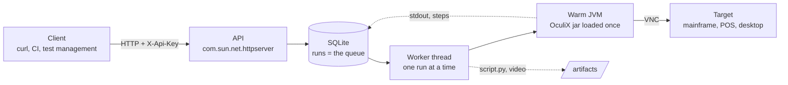
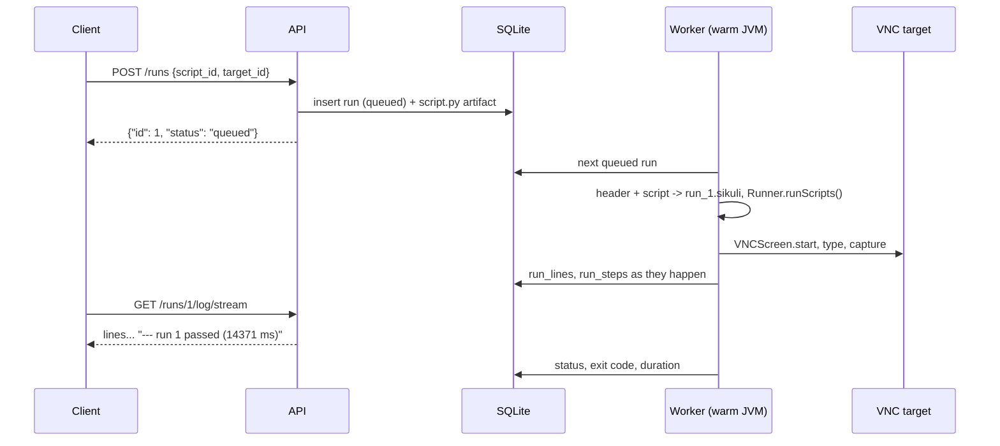
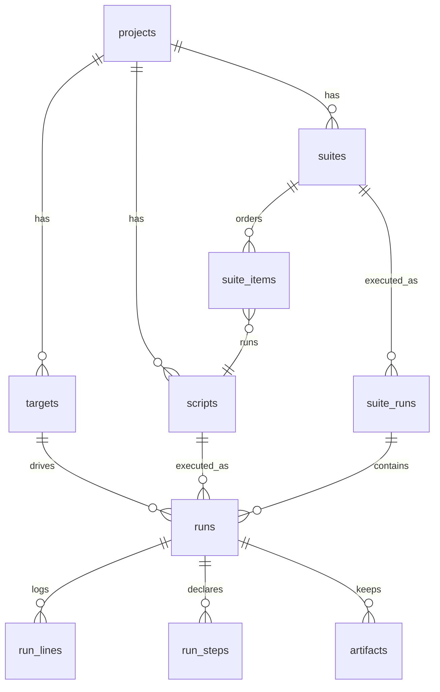

# oculix-runner

[](LICENSE)
[](service/pom.xml)
[](https://github.com/oculix-org/Oculix)
[](https://github.com/julienmerconsulting/oculix-runner/pkgs/container/target-mainframe-kicks)

A warm OculiX JVM behind an HTTP API, with a SQLite base that records everything: projects, VNC
targets, scripts, suites, runs, log lines, steps, artifacts, keys, audit. The OculiX jar is not
modified: the service loads it once and hands it Jython scripts. After the first run, a `print`
script executes in 0.7 s instead of 15.

The runner drives any VNC target: a mainframe 3270 session, a point-of-sale, a remote Windows or
Linux desktop. Nothing is installed on the target. A demo target, TK5 (MVS 3.8j under Hercules)
with KICKS 1.5.0, is available under a compose profile for those who have none at hand.

Full API reference with real responses: [`docs/API.md`](docs/API.md); OpenAPI:
[`docs/openapi.yaml`](docs/openapi.yaml).

## 🧭 How it fits together



| Piece | What it is | Where |
|---|---|---|
| API | JDK HTTP server, JSON, API keys with scopes | `service/src/main/java/org/oculix/runner/Api.java` |
| Engine | loads OculiX once, executes queued runs, captures their output | `Engine.java` |
| Base | SQLite, WAL, one file | `/workdir/runner.db`, schema in `schema.sql` |
| Header | what every script gets for free: `RUN`, `PARAMS`, `TARGET`, `step()` | `header.py` |
| Artifacts | the exact script of each run, optional video | `/workdir/artifacts/<project>/<run>/` |

## 🚀 Start

```
docker compose build oculix-runner
RUNNER_BOOTSTRAP_KEY=orx_my_key docker compose up -d
curl http://localhost:8765/health
```

Only the runner starts. For the demo mainframe as well:

```
docker compose --profile lab up -d
```

The image is pulled from GHCR on first use; the mainframe takes about a minute to IPL and noVNC
shows it at http://localhost:6081/vnc.html.

Without `RUNNER_BOOTSTRAP_KEY`, an admin key is generated on first start and printed once in
`docker compose logs oculix-runner`. Only its hash is stored.

The engine takes 15 to 20 s to be ready (`"engine":"ready"` in `/health`). Runs submitted before
that wait in the queue.

## ▶️ First run

Replace `host` with your own VNC target; `target-mainframe-kicks` is the demo mainframe.

```
K='X-Api-Key: orx_my_key'
B=http://localhost:8765

curl -s -X POST -H "$K" -H 'Content-Type: application/json' \
  -d '{"code":"lab","name":"Mainframe lab"}' $B/projects
curl -s -X POST -H "$K" -H 'Content-Type: application/json' \
  -d '{"name":"tk5","host":"target-mainframe-kicks","port":5900,"stage":"INT"}' $B/projects/1/targets
curl -s -X POST -H "$K" --data-binary @scripts/tk5-type.py \
  "$B/projects/1/scripts/raw?name=tk5-type"
curl -s -X POST -H "$K" -H 'Content-Type: application/json' \
  -d '{"project_code":"lab","script_id":1,"target_id":1}' $B/runs
curl -s -H "$K" $B/runs/1/log/stream
```

The last call prints the log live and ends with `--- run 1 passed (14371 ms)`.



## ✍️ Writing a script

A script is ordinary OculiX Jython. The service prepends a header
(`service/src/main/resources/header.py`) that provides:

| Name | What it holds |
|---|---|
| `RUN` | id, name, parameters and target of the run, read from `run.json` |
| `PARAMS` | the dictionary passed as `params` when the run was created |
| `TARGET` | `host`, `port`, `display`, `secret_ref` of the target, plus `password` resolved from the environment variable named by `secret_ref`; `TARGET_VNC_HOST` and `TARGET_VNC_PORT` are also set in `os.environ` |
| `step(label, status, detail)` | declares a step: `START`, `PASS`, `FAIL`, `SKIP`, `INFO`; a `START` followed by a `PASS` or `FAIL` with the same label closes it |

The VNC connection stays in the script: `VNCScreen.start(TARGET["host"], TARGET["port"], 10, 0)`.
Error line numbers returned by the API are those of the script, header excluded.

## 🔌 API at a glance

Everything requires `X-Api-Key` except `/health`. Scopes: `read` (GET), `run` (scripts, suites,
runs, abort), `admin` (projects, targets, keys, audit). `admin` includes `run`, `run` includes `read`.
Details, fields and real responses in [`docs/API.md`](docs/API.md).

| Method and route | Scope | Role |
|---|---|---|
| `GET /health` | none | engine state, current run, queue |
| `GET /version` | read | service and OculiX versions, jar hash |
| `POST /projects`, `GET /projects`, `GET /projects/{id}` | admin / read | projects |
| `POST /projects/{id}/targets`, `GET /projects/{id}/targets`, `GET /targets/{id}`, `PUT /targets/{id}` | admin / read | VNC targets |
| `GET /targets/{id}/check` | run | TCP connection to the target |
| `POST /projects/{id}/scripts` (JSON), `POST /projects/{id}/scripts/raw?name=` (body = the `.py`) | run | create a script |
| `GET /projects/{id}/scripts`, `GET /scripts/{id}`, `GET /scripts/{id}/content` | read | read |
| `PUT /scripts/{id}` (JSON), `PUT /scripts/{id}/content` (raw) | run | new version |
| `POST /projects/{id}/suites`, `PUT /suites/{id}/items`, `GET /suites/{id}` | run / read | ordered suites |
| `POST /suites/{id}/run` | run | queues every script of the suite |
| `GET /suite-runs/{id}`, `GET /projects/{id}/suite-runs`, `POST /suite-runs/{id}/abort` | read / run | suite executions |
| `POST /runs` | run | one run: `script_id` or inline `code`, `target_id`, `params`, `timeout_ms` |
| `GET /runs`, `GET /runs/{id}` | read | runs and their steps |
| `GET /runs/{id}/log?after=&wait=`, `GET /runs/{id}/log/stream` | read | log, long-poll or streamed |
| `GET /runs/{id}/steps`, `GET /runs/{id}/artifacts`, `GET /artifacts/{id}` | read | steps and files |
| `POST /runs/{id}/abort` | run | removes from the queue or interrupts the running script |
| `POST /keys`, `GET /keys`, `DELETE /keys/{id}` | admin | keys; the clear key is shown only at creation |
| `GET /audit`, `GET /engine/events` | admin / read | action journal, engine events |

Run statuses: `queued`, `running`, `passed`, `failed`, `timeout`, `aborted`, `error`, `skipped`.
One run executes at a time; the others wait in creation order. A suite stops at the first failure
unless the item has `continue_on_failure`.

## 🗄️ Data

`/workdir` (volume `runner-data`): `runner.db`, `runs/` (the composed `.sikuli` folders),
`artifacts/<project>/<run>/` (the exact script of each run). Schema in
`service/src/main/resources/schema.sql`.



## ⚙️ Environment variables

| Variable | Default | Role |
|---|---|---|
| `RUNNER_HTTP_PORT` | `8765` | HTTP port |
| `RUNNER_DATA_DIR` | `/workdir` | base, runs, artifacts |
| `OCULIX_JAR` | `/opt/oculix/oculix.jar` | the jar loaded |
| `RUNNER_DEBUG_LEVEL` | `3` | OculiX debug level |
| `RUNNER_DEFAULT_TIMEOUT_MS` | `0` | default run timeout, 0 = none |
| `RUNNER_BOOTSTRAP_KEY` | generated | admin key of the first start |
| `JAVA_OPTS` | empty | JVM options |

## ☕ The OculiX jar

By default the build downloads release `4.0.0` of `oculix-org/Oculix` and checks its SHA-256. For
another jar (local build, release candidate), copy it to `jars/oculix.jar` before building: it
takes precedence over the download. The folder is ignored by git.

About `4.0.0`: two fixes made since are not in it, the ZRLE bug of `tigervnc-java-oculix` 2.0.1
(#443) and `Key.ENTER` sending a Linefeed to x3270 instead of Enter. The lab's TSO logon was
validated with a jar built from `chore/global-bug-fixes`, placed in `jars/`. The next OculiX
release will carry both.

## 🔧 Building the service alone

```
cd service
mvn -Doculix.jar=/path/to/oculixide-4.0.0-linux.jar package
```

Produces `target/oculix-runner-service.jar`. Manual launch:

```
xvfb-run -a -s "-screen 0 1280x1024x24" \
  java -cp target/oculix-runner-service.jar:/path/to/oculix.jar org.oculix.runner.Main
```

## 🖥️ Demo target: the mainframe lab

[`lab/KICKS.md`](lab/KICKS.md): start the TK5 with KICKS from the public image, or install it
yourself with the guide. `lab/snapshot.sh`: dated snapshot of the containers. `scripts/`: the lab
scripts, `tk5-type.py` (HERC01 logon) and `oculix-check.py` (capture + OCR).

The installation guide, `lab/Guide_installation_KICKS_1.5.0_TK5_OculiX.pdf`, is in French: it is
the author's working document and stays as written. Any AI translates it in a minute.

## 📜 Credits and licenses

- **OculiX**, MIT, [oculix-org/Oculix](https://github.com/oculix-org/Oculix): the jar the runner
  loads.
- **Hercules** SDL Hyperion, [SDL-Hercules-390](https://github.com/SDL-Hercules-390/hyperion):
  the emulator inside the lab images.
- **TK5**, the MVS 3.8j Turnkey system by Rob Prins, [prince-webdesign.nl](https://www.prince-webdesign.nl/tk5):
  MVS 3.8j itself is in the public domain.
- **KICKS for TSO 1.5.0**, © Michael Noel, [moshix/kicks](https://github.com/moshix/kicks). Its
  license is inside the image, member `HERC01.KICKSSYS.V1R5M0.DOC(LICENSE)`. The image
  `ghcr.io/julienmerconsulting/target-mainframe-kicks` redistributes the complete original package,
  free of charge, as that license requires; the objects modified for TK5 (`VOLUMES(WORK01)` in
  the load jobs) and the added `MYLOGON` are in source form, next to the originals. No KICKS
  object is stored in this repository.

This repository itself is under the [MIT license](LICENSE).
