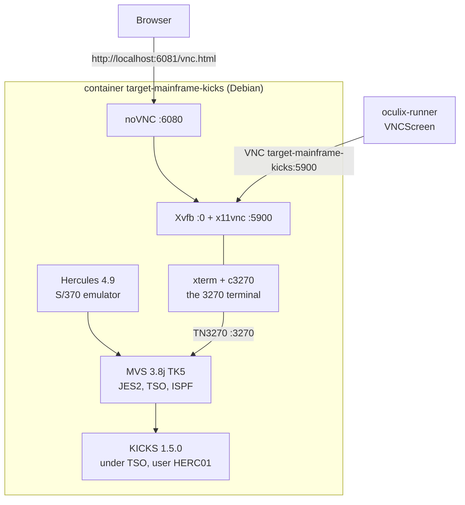
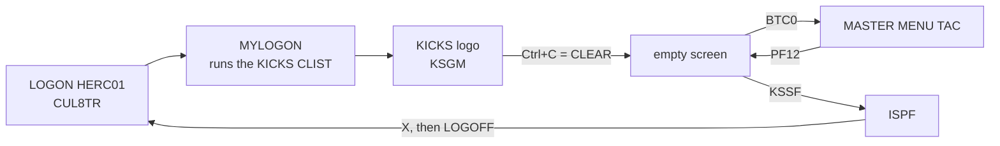

# KICKS 1.5.0 on TK5 — the demo mainframe

[](https://github.com/julienmerconsulting/oculix-runner/pkgs/container/target-mainframe-kicks)
[](https://www.prince-webdesign.nl/tk5)
[](https://github.com/moshix/kicks)

A real MVS 3.8j (the 1981 IBM system, public domain) under the Hercules emulator, with KICKS, a
CICS-like transaction monitor, already installed and starting at logon. One `docker compose`
away, so the runner has a 3270 screen to type into and read.

## 🧱 What is inside



| Layer | Real or imitation | Notes |
|---|---|---|
| Hercules | emulator | SDL Hyperion 4.9, `TZOFFSET +0000`, MVS shows UTC+1 |
| MVS 3.8j | the real IBM system | TK5 distribution by Rob Prins |
| TSO, ISPF, JES2 | real | user HERC01, 60 min idle time-out (S522) |
| KICKS | CICS look-alike | v1r5m0 by Michael Noel, datasets `HERC01.KICKS*`, demo apps TAC and Murach |

## 🚀 Start

```
docker compose --profile lab up -d target-mainframe-kicks
```

The image (about 1 GB) is pulled from GHCR on first use. IPL takes about a minute; the container
is `healthy` once TN3270 answers. Memory 1 GB, 1 CPU.

| Host port | Container | What |
|---|---|---|
| 6081 | 6080 | noVNC, the screen in a browser: http://localhost:6081/vnc.html |
| 5901 | 5900 | VNC, what the runner drives; inside the compose network: `target-mainframe-kicks:5900` |
| 3271 | 3270 | TN3270, for x3270 or c3270 |
| 8039 | 8038 | Hercules web console |

TSO account: `HERC01` / `CUL8TR` (the public TK5 account).

## ⌨️ Using it



| Step | Keys |
|---|---|
| Log on | `LOGON HERC01`, Enter, `CUL8TR`, Enter |
| KICKS appears by itself | `HERC01.CMDPROC(MYLOGON)` runs `EXEC 'HERC01.KICKSSYS.V1R5M0.CLIST(KICKS)'` |
| CLEAR | Ctrl+C in this c3270 under noVNC |
| Open the demo application | `BTC0`, Enter: the TAC master menu (Nevada Department of Labor) |
| Leave KICKS | Ctrl+C, then `KSSF`, Enter: back to ISPF |
| Log off | `X` out of ISPF, then `LOGOFF`; otherwise MVS ends the idle session after 60 min |

To get the plain logon back, delete the `MYLOGON` member. Paste in noVNC: the clipboard panel on
the left, then Shift+Insert in the screen.

## 💾 Saving a change

The DASD files live inside the container, not in a volume. After any change inside MVS:

```
docker commit target-mainframe-kicks ghcr.io/julienmerconsulting/target-mainframe-kicks:1.5.0-installed
docker push ghcr.io/julienmerconsulting/target-mainframe-kicks:1.5.0-installed
```

Never run `docker compose down`, `up --build` or `--force-recreate` on this service without having
pushed first: the container is recreated and the changes are gone.

## 📨 Sending a job without a terminal

Hercules exposes a card reader on port 3505 inside the container. Anything written to it is read
as a job by JES2. RAKF wants the user on the JOB card, and JCL stops at column 71:

```
docker exec -i target-mainframe-kicks bash -c 'cat > /dev/tcp/127.0.0.1/3505' <<'EOF'
//HELLO    JOB CLASS=A,MSGCLASS=A,MSGLEVEL=(1,1),
//             USER=HERC01,PASSWORD=CUL8TR
//STEP1    EXEC PGM=IEFBR14
//
EOF
docker exec target-mainframe-kicks grep HELLO /opt/tk5/log/hardcopy.log
```

This is how `MYLOGON` was added: an `IEBUPDTE` job with `SYSUT1` and `SYSUT2` on
`HERC01.CMDPROC`.

## 🛠️ Installing KICKS yourself

On a bare TK5, follow `Guide_installation_KICKS_1.5.0_TK5_OculiX.pdf`, appendix A for the
compact sequence. The guide is in French; any AI translates it in a minute. The only edit to make
in the distribution: `VOLUMES(PUB002)` → `VOLUMES(WORK01)` in jobs `LOADMUR`, `LOADTAC`, `LOADSDB`
(`KICKS.V1R5M0.INSTLIB`) and `LODINTRA`, `LODTEMP` (`KICKSSYS.V1R5M0.INSTLIB`), closing
parenthesis included.

## 📜 License

KICKS objects are not in this repository: its license only allows redistributing the complete
package, which is what the image does, free of charge, with the license inside it
(`HERC01.KICKSSYS.V1R5M0.DOC(LICENSE)`). Modified objects (`WORK01`, `MYLOGON`) are in source
form next to the originals. See "Credits and licenses" in the README.
